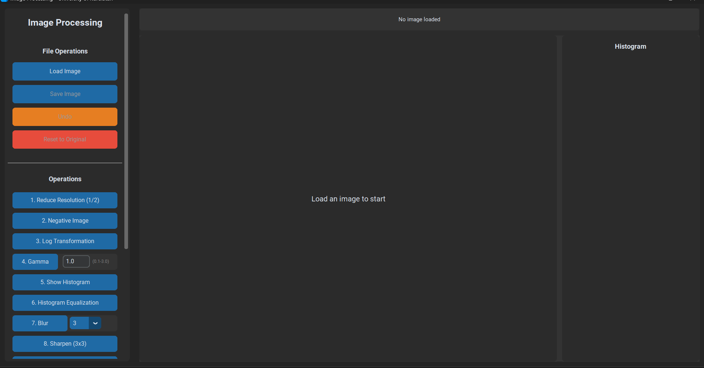
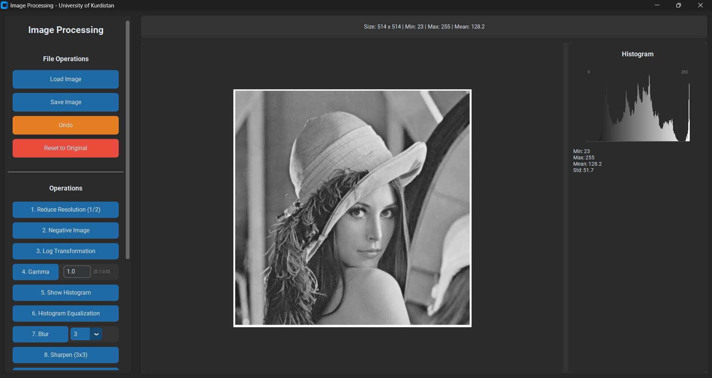
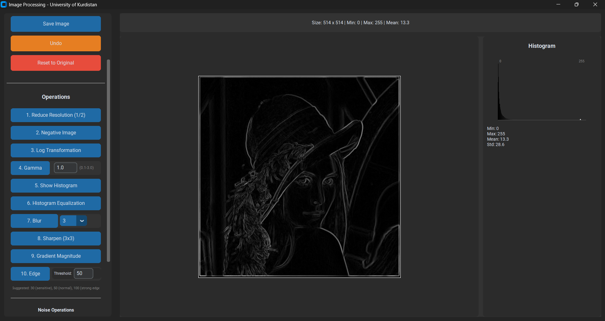
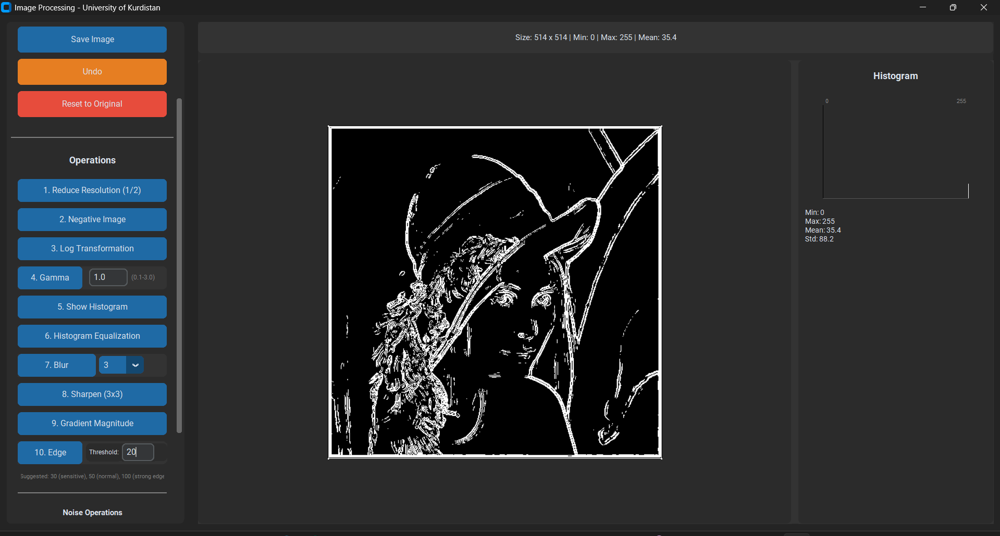
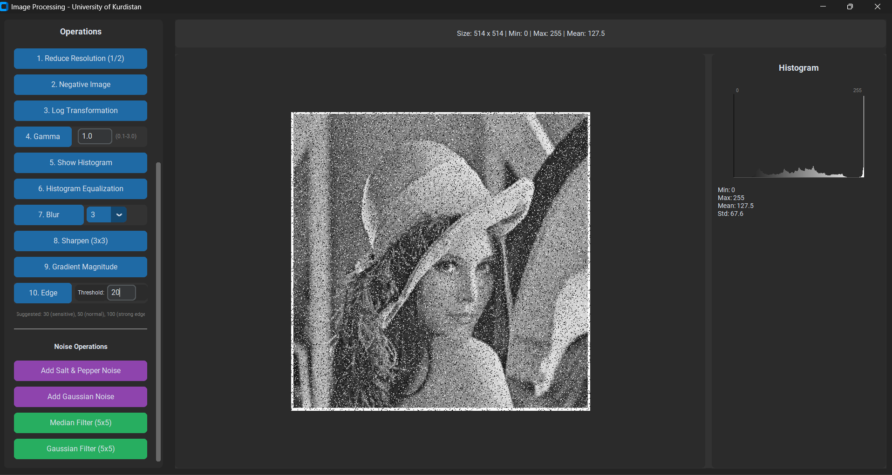
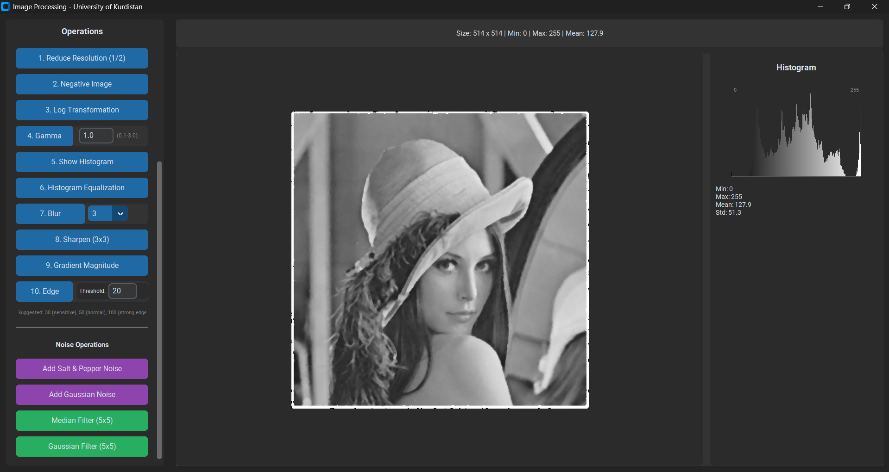

<div align="center">

# 🖼️ Image Processing Tool

### Advanced Image Processing Software
**University of Kurdistan - Computer Department**

[](https://github.com/MSadeghSeyfi/image-processing-course-project/releases)
[](https://github.com/MSadeghSeyfi/image-processing-course-project)
[](https://www.python.org/)
[](https://github.com/MSadeghSeyfi/image-processing-course-project)

[📥 Download](#-download) • [✨ Features](#-features) • [📸 Screenshots](#-screenshots) • [🚀 Quick Start](#-quick-start) • [📖 Documentation](#-documentation)

</div>

---

## 📥 Download

**Latest Release: v1.0.0** - [Download ImageProcessingTool-v1.0.0-windows.zip](https://github.com/MSadeghSeyfi/image-processing-course-project/releases/latest)

- **Size**: 31 MB
- **Platform**: Windows 10 or higher (64-bit)
- **No Installation Required**: Standalone executable with all dependencies included

---

## 🚀 Quick Start

### Installation & Usage

<table>
<tr>
<td width="50%">

### Method 1: Direct Execution ⚡
1. Download `ImageProcessingTool.exe`
2. Double-click to run
3. Start processing images!

**No Python or libraries needed**

</td>
<td width="50%">

### Method 2: Create Shortcut 📌
1. Right-click on the `.exe` file
2. Select **"Create shortcut"**
3. Move to Desktop or Start Menu
4. Launch anytime!

</td>
</tr>
</table>

> **⚠️ Windows SmartScreen Warning**: On first run, click **"More info"** → **"Run anyway"**
> This is normal for unsigned applications.

---

## ✨ Features

<details open>
<summary><b>🔧 Image Processing Operations</b></summary>

### Geometric Transformations
- ✅ **Resolution Reduction** - Reduce image dimensions using subsampling

### Intensity Transformations
- ✅ **Negative Transform** - Invert pixel values
- ✅ **Logarithmic Transform** - Enhance details in dark regions
- ✅ **Gamma Correction** - Adjustable brightness control

### Histogram Operations
- ✅ **Histogram Display** - Visualize pixel intensity distribution
- ✅ **Histogram Equalization** - Automatic contrast enhancement

### Spatial Filters
- ✅ **Blur Filter** - Smooth images using average filter
- ✅ **Sharpen Filter** - Enhance edge clarity
- ✅ **Median Filter** - Remove salt & pepper noise
- ✅ **Gaussian Filter** - Advanced smoothing with edge preservation

### Edge Detection
- ✅ **Gradient Magnitude** - Calculate edge intensity
- ✅ **Threshold-based Edge Detection** - Extract edges with adjustable sensitivity

### Noise Generation
- ✅ **Salt & Pepper Noise** - Add random black/white noise
- ✅ **Gaussian Noise** - Add noise with normal distribution

</details>

<details open>
<summary><b>🎯 User Interface Features</b></summary>

- 🖱️ **Intuitive GUI** - Modern dark theme with CustomTkinter
- 📂 **Multi-format Support** - JPG, PNG, BMP
- ↩️ **Undo System** - Revert up to 20 operations
- 🔄 **Reset Function** - Return to original image
- 📊 **Inline Histogram** - Real-time histogram display
- ⏳ **Progress Indicators** - Visual feedback for long operations
- 🎨 **Live Preview** - See changes instantly

</details>

---

## 📸 Screenshots

<div align="center">

### Main Interface


### Image Processing Operations

<table>
<tr>
<td width="50%">

<p align="center"><em>Intensity Transformations</em></p>
</td>
<td width="50%">

<p align="center"><em>Histogram Operations</em></p>
</td>
</tr>
<tr>
<td width="50%">

<p align="center"><em>Spatial Filters</em></p>
</td>
<td width="50%">

<p align="center"><em>Edge Detection</em></p>
</td>
</tr>
<tr>
<td colspan="2">

<p align="center"><em>Noise Operations & Advanced Features</em></p>
</td>
</tr>
</table>

</div>

---

## 💻 System Requirements

| Component | Requirement |
|-----------|-------------|
| **Operating System** | Windows 10 or higher (64-bit) |
| **RAM** | Minimum 2GB (4GB recommended) |
| **Disk Space** | 50MB for application |
| **Display** | 1000x700 pixels or higher |
| **Additional Software** | None - Completely standalone |

---

## 📖 Documentation

### Supported Image Formats
- **Input**: JPG, JPEG, PNG, BMP
- **Output**: PNG, JPG, BMP

### Processing Parameters
- **Gamma Correction**: Adjustable gamma value (0.1 - 5.0)
- **Edge Detection**: Customizable threshold (0 - 255)
- **Noise Intensity**: Configurable noise levels

### Performance
- Optimized for real-time processing
- Multi-threaded operations for large images
- Efficient memory management

---

## 🐛 Troubleshooting

<details>
<summary><b>Application Won't Run</b></summary>

**Possible Causes:**
- Antivirus blocking the executable
- Missing system updates

**Solutions:**
1. Add to antivirus whitelist
2. Update Windows to latest version
3. Install Visual C++ Redistributable if needed

</details>

<details>
<summary><b>Windows SmartScreen Warning</b></summary>

**Why it happens:**
The application is not digitally signed (common for educational projects)

**How to bypass:**
1. Click **"More info"**
2. Click **"Run anyway"**

This is completely safe - the warning is expected.

</details>

<details>
<summary><b>Slow Performance</b></summary>

**Tips for better performance:**
- Close other applications
- Process smaller images first
- First launch may be slower (file extraction)
- Subsequent launches will be faster

</details>

---

## 🛠️ Technical Stack

```yaml
Language: Python 3.12.9
GUI Framework: CustomTkinter 5.2.0
Image Processing: Pillow 10.0.0+
Numerical Computing: NumPy 1.24.0+
Packaging: PyInstaller 6.17.0
```

### Architecture
- **Frontend**: CustomTkinter (Modern Tkinter wrapper)
- **Backend**: NumPy-based image processing algorithms
- **Threading**: Multi-threaded for responsive UI
- **Packaging**: Single-file executable with embedded dependencies

---

## 📝 Changelog

### Version 1.0.0 (January 2026)
- ✅ Initial release
- ✅ Complete image processing toolkit
- ✅ Modern GUI with dark theme
- ✅ Standalone Windows executable
- ✅ 20-step undo system
- ✅ Inline histogram visualization
- ✅ Progress indicators
- ✅ Configurable parameters

---

## 👨‍💻 Development

**Developer**: University of Kurdistan - Computer Department
**Purpose**: Image Processing Course Project
**Academic Year**: 2025-2026

### For Developers
If you want to run from source:

```bash
# Clone the repository
git clone https://github.com/MSadeghSeyfi/image-processing-course-project.git
cd image-processing-course-project/interface

# Create virtual environment
python -m venv venv
venv\Scripts\activate

# Install dependencies
pip install -r requirements.txt

# Run the application
python main.py
```

---

## 📄 License

This software is provided for **educational and research purposes**.

```
Copyright (c) 2026 University of Kurdistan
Educational Use Only
```

---

## 🤝 Contributing

This is an educational project, but suggestions and feedback are welcome!

- 🐛 **Report bugs**: [Create an issue](https://github.com/MSadeghSeyfi/image-processing-course-project/issues)
- 💡 **Feature requests**: [Open a discussion](https://github.com/MSadeghSeyfi/image-processing-course-project/discussions)
- 📧 **Contact**: Via GitHub issues

---

## 🌟 Acknowledgments

- **University of Kurdistan** - Computer Department
- **CustomTkinter** - Modern UI framework
- **PIL/Pillow** - Image processing library
- **NumPy** - Numerical computing

---

<div align="center">

### ⭐ Star this repository if you found it useful!

**Made with ❤️ at University of Kurdistan**

[⬆ Back to Top](#-image-processing-tool)

</div>
